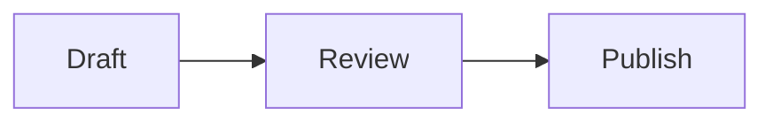
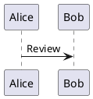

<p align="center">
  
</p>

<h1 align="center">Markscope</h1>

<p align="center">Review Markdown structure without leaving VS Code.</p>

<p align="center">
  <a href="https://marketplace.visualstudio.com/items?itemName=m2tkl.markscope-vscode"></a>
</p>

Markscope places a navigable outline beside the selected section of your Markdown document. It is designed for reviewing long documents where heading hierarchy, topic flow, and section balance matter.

## Features

- **Structure-first review:** scan the document by heading without rendering every section at once.
- **Focused reading:** show only the selected section, or add its first paragraph to the outline.
- **Direct editing:** double-click an outline entry to edit its heading, or double-click a word in the rendered paragraph to edit it at the source position.
- **Editor synchronization:** follow the active Markdown editor cursor from the outline.
- **Flexible layout:** use automatic, side-by-side, or stacked reading panes.
- **Heading filters:** limit the outline to the heading depth relevant to your review.
- **Local rendering:** preview tables, local images, Mermaid diagrams, and PlantUML diagrams without an external rendering service.

## Getting Started

1. Open a Markdown file in VS Code.
2. Run `Markscope: Open Preview` from the Command Palette.
3. Select a heading in the outline to review that section.

You can also open Markscope in either of these ways:

- Choose `Open in Markscope` from a Markdown file's Explorer context menu.
- Choose `Markscope Preview` from `Reopen Editor With...` or `Open With...`.

## Editing From The Preview

| Interaction | Result |
| --- | --- |
| Click an outline entry | Select and render that section |
| Double-click an outline entry | Open the Markdown editor at that heading |
| Double-click a word in a paragraph | Open the editor at the beginning of that word |
| Double-click empty body space | Open the editor at the selected heading |
| Select `Edit` | Open the editor at the selected heading |

Markdown emphasis and link syntax are accounted for when locating the selected word in the source.

## Keyboard Navigation

| Key | Action |
| --- | --- |
| `ArrowDown` or `j` | Select the next visible heading |
| `ArrowUp` or `k` | Select the previous visible heading |

## Diagram Support

Use fenced code blocks to render diagrams inside the selected section.

````markdown



````

PlantUML fences may use either `plantuml` or `puml` as the language identifier.

## Requirements

- Visual Studio Code 1.96 or later
- A local Markdown file with a `.md`, `.markdown`, `.mdown`, or `.mkd` extension

Markscope bundles its Markdown and diagram renderers. It does not require a separate CLI, sibling checkout, or rendering server.

## Development

Enter the Nix development shell and install dependencies:

```sh
nix develop
pnpm install --frozen-lockfile
```

Run verification:

```sh
pnpm test
pnpm run compile
```

Launch the `Run Extension` target from VS Code to open an Extension Development Host. To create a local package, run:

```sh
pnpm run package
```

See [docs/release.md](docs/release.md) for the complete release checklist.

## License

[MIT](LICENSE)
